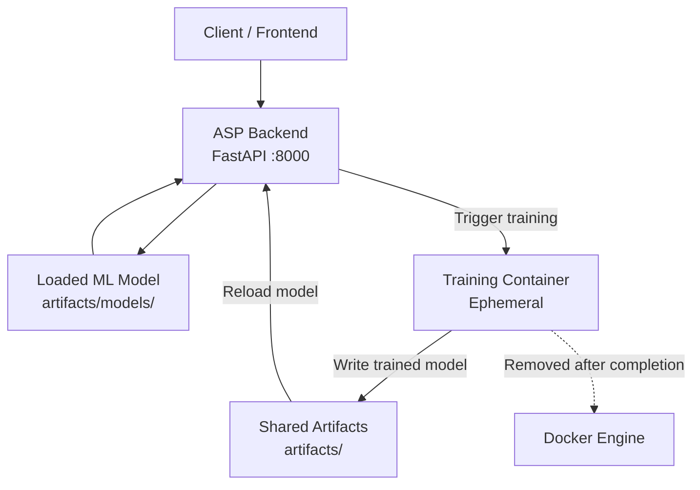
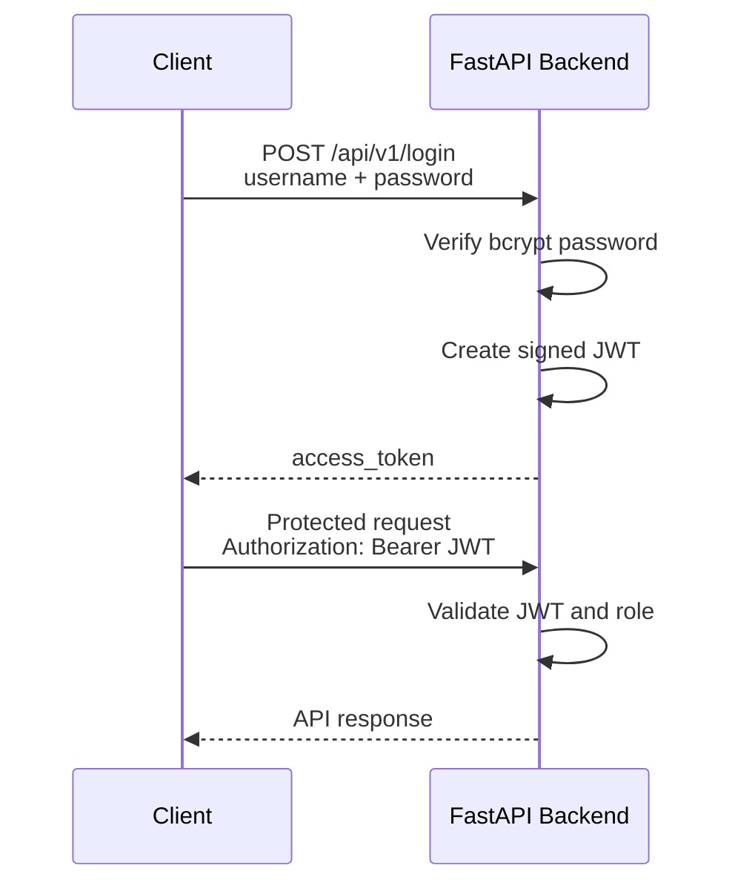

# Backend Service

The ASP backend is a FastAPI application responsible for authentication, authorization, accident severity prediction, model management, and training orchestration.

The backend runs as a persistent Docker container. Model training is handled by a separate, short-lived training container that is launched by the backend when requested.

---

## 1. Architecture

The backend is composed of three main responsibilities:

* **FastAPI backend** — handles API requests, authentication, prediction and training requests.
* **Model artifacts** — stored in the shared `artifacts/` directory and loaded by the backend.
* **Training container** — launched on demand by the backend to train a new model.



The backend and training container share the project's `data/` and `artifacts/` directories.

The backend also has access to the Docker socket so it can launch the training container. The training service itself is defined with the `build-only` Compose profile and is therefore not started by a normal `docker compose up`.

### Training lifecycle

The training workflow is:

```text
POST /api/v1/train
        │
        ▼
     Backend
        │
        │ Background task
        ▼
 Training container
        │
        │ reads data/processed/
        │ writes artifacts/
        ▼
  Training completed
        │
        ▼
 Backend reloads model
```

The training container is temporary and is removed after the training command completes.

---

## 2. Backend Structure

The backend source code is located under:

```text
services/backend/
├── src/
│   ├── config/
│   ├── core/
│   ├── routes/
│   ├── schemas/
│   ├── services/
│   └── main.py
├── tests/
└── Dockerfile.backend
```

The API routes currently cover:

* authentication;
* health checks;
* prediction;
* training;
* model reload.

The main service modules handle prediction and training orchestration.

---

## 3. Environment Configuration

The backend requires a `.env.backend` file in the project root.

This file contains the application users and JWT configuration.

### Generate password hashes

Passwords are stored as bcrypt hashes.

The hashes are Base64-encoded before being placed in `.env.backend`. This avoids problems with `$` characters in bcrypt hashes being interpreted by Docker Compose as environment-variable substitutions.

Generate a password hash with:

```bash
python -c "import bcrypt, base64; h = bcrypt.hashpw(b'your-password', bcrypt.gensalt()); print(base64.b64encode(h).decode())"
```

Generate a JWT secret with:

```bash
openssl rand -hex 32
```

Example:

```env
# Application users

ADMIN_USERNAME=admin
ADMIN_PASSWORD_HASH_B64=<base64-encoded-bcrypt-hash>

USER_USERNAME=datascientest
USER_PASSWORD_HASH_B64=<base64-encoded-bcrypt-hash>

# JWT configuration

JWT_SECRET_KEY=<generated-secret>
JWT_ALGORITHM=HS256
JWT_EXPIRE_MINUTES=180
```

> **Security:** Never commit `.env.backend` or real credentials to Git. Each developer should use their own local credentials and JWT secret.

---

## 4. Authentication and Authorization

The API uses JWT Bearer authentication.

Two roles are currently configured:

| Role  | Prediction | Training |
| ----- | ---------: | -------: |
| User  |          ✅ |        ❌ |
| Admin |          ✅ |        ✅ |

### Authentication flow



Protected endpoints require:

```http
Authorization: Bearer <JWT_TOKEN>
```

The JWT signing secret is used by the backend to create and validate access tokens.

The JWT secret is **not** related to the Nginx TLS certificate or private key. TLS is handled by the reverse proxy; JWT authentication is handled by FastAPI.

---

## 5. API Endpoints

| Method | Endpoint          | Authentication    | Access           |
| ------ | ----------------- | ----------------- | ---------------- |
| `GET`  | `/api/v1/health`  | None              | Public           |
| `POST` | `/api/v1/login`   | Username/password | Configured users |
| `POST` | `/api/v1/predict` | JWT               | User / Admin     |
| `POST` | `/api/v1/train`   | JWT               | Admin only       |

---

## 6. Start the Backend

### 6.1 Build the training image

The training image is built separately because the training service uses the `build-only` Compose profile.

```bash
docker compose --profile build-only build training
```

### 6.2 Start the backend

```bash
docker compose up -d --build backend
```

The backend listens on port `8000` inside the Docker network.

The port is exposed to other containers but is not published directly on the host.

### 6.3 Check the container status

```bash
docker compose ps
```

The backend should eventually report a healthy status.

### 6.4 Check the health endpoint

When testing the backend directly from the host, port `8000` is not published by the current Compose configuration. The normal client-facing path is therefore through Nginx.

See [Reverse Proxy](reverse_proxy.md) for the complete HTTPS setup.

For an internal container-level health check, the backend itself uses:

```text
http://localhost:8000/api/v1/health
```

---

## 7. Test the API

The following examples assume that the reverse proxy is running and that the API is available at:

```text
https://asp.local:8081
```

See [Reverse Proxy](reverse_proxy.md) for the required setup.

### 7.1 Health check

```bash
curl -k https://asp.local:8081/api/v1/health
```

A successful request should return a JSON health response.

---

### 7.2 Login as a standard user

Use the credentials configured in `.env.backend`.

```bash
TOKEN=$(curl -sk -X POST https://asp.local:8081/api/v1/login \
  -H "Content-Type: application/x-www-form-urlencoded" \
  -d "username=datascientest&password=<USER_PASSWORD>" \
  | python3 -c "import sys, json; print(json.load(sys.stdin)['access_token'])")
```

Verify that the token was received:

```bash
echo "$TOKEN"
```

Do not commit or share the token.

---

### 7.3 Test prediction

The prediction endpoint requires a valid JWT.

```bash
curl -sk -X POST https://asp.local:8081/api/v1/predict \
  -H "Authorization: Bearer $TOKEN" \
  -H "Content-Type: application/json" \
  -d '{
    "place": 1,
    "catu": 1,
    "sexe": 1,
    "secu1": 1,
    "year_acc": 2023,
    "victim_age": 30,
    "nb_victim": 1,
    "catv": 2,
    "obsm": 0,
    "motor": 1,
    "nb_vehicles": 1,
    "catr": 1,
    "circ": 1,
    "surf": 1,
    "situ": 1,
    "vma": 50,
    "jour": 1,
    "mois": 1,
    "lum": 1,
    "dep": 75,
    "com": 101,
    "agg": 1,
    "int": 1,
    "atm": 0,
    "col": 1,
    "lat": 48.85,
    "long": 2.35,
    "hour": 14
  }'
```

The endpoint requires a trained model to be available in `artifacts/models/`.

---

### 7.4 Login as administrator

Use the administrator credentials configured in `.env.backend`:

```bash
TOKEN_ADMIN=$(curl -sk -X POST https://asp.local:8081/api/v1/login \
  -H "Content-Type: application/x-www-form-urlencoded" \
  -d "username=admin&password=<ADMIN_PASSWORD>" \
  | python3 -c "import sys, json; print(json.load(sys.stdin)['access_token'])")
```

---

### 7.5 Trigger model training

Training requires the administrator role.

```bash
curl -sk -X POST https://asp.local:8081/api/v1/train \
  -H "Authorization: Bearer $TOKEN_ADMIN" \
  -H "Content-Type: application/json" \
  -d '{}'
```

The endpoint returns immediately with a `started` status because training is launched as a background task.

The training container then:

1. reads the processed data;
2. trains the model;
3. writes the resulting artifacts;
4. exits;
5. is removed;
6. causes the backend to reload the newly generated model.

The training route explicitly implements this asynchronous behavior using FastAPI `BackgroundTasks`.

Monitor the backend logs:

```bash
docker compose logs -f backend
```

---

## 8. Verify Training

Check the backend logs:

```bash
docker compose logs -f backend
```

You can also inspect running containers:

```bash
docker ps
```

The training container is expected to be short-lived. It may disappear before it can be observed with `docker ps`.

After successful training, the backend reloads the model.

Verify the backend again:

```bash
curl -sk https://asp.local:8081/api/v1/health
```

---

## 9. Backend Security

The backend implements several security controls:

* passwords are stored as bcrypt hashes;
* password hashes are Base64-encoded for Docker environment compatibility;
* JWT Bearer authentication protects private endpoints;
* role-based authorization restricts model training to administrators;
* `.env.backend` is kept outside version control;
* the backend port `8000` is internal to the Docker network;
* client-facing HTTPS is handled by the Nginx reverse proxy.

The backend should normally be accessed through the reverse proxy rather than exposed directly to clients.

See [Reverse Proxy](reverse_proxy.md) for the client-facing security layer.

---

## 10. Troubleshooting

### Backend is not healthy

Check:

```bash
docker compose ps
```

Then inspect the logs:

```bash
docker compose logs backend
```

### Authentication fails

Check:

* `.env.backend` exists in the project root;
* the username matches the configured username;
* the password matches the password used to generate the bcrypt hash;
* `JWT_SECRET_KEY` is configured;
* the backend was recreated after changing `.env.backend`.

Restart the backend after changing environment variables:

```bash
docker compose up -d --build backend
```

### Prediction fails because no model is available

Check the model directory:

```bash
ls -la artifacts/models/
```

If no trained model is available, run the training workflow using an administrator token.

### Training fails

Check the backend logs:

```bash
docker compose logs -f backend
```

Then verify that the training image exists:

```bash
docker images | grep asp-training
```

If necessary, rebuild it:

```bash
docker compose --profile build-only build training
```
