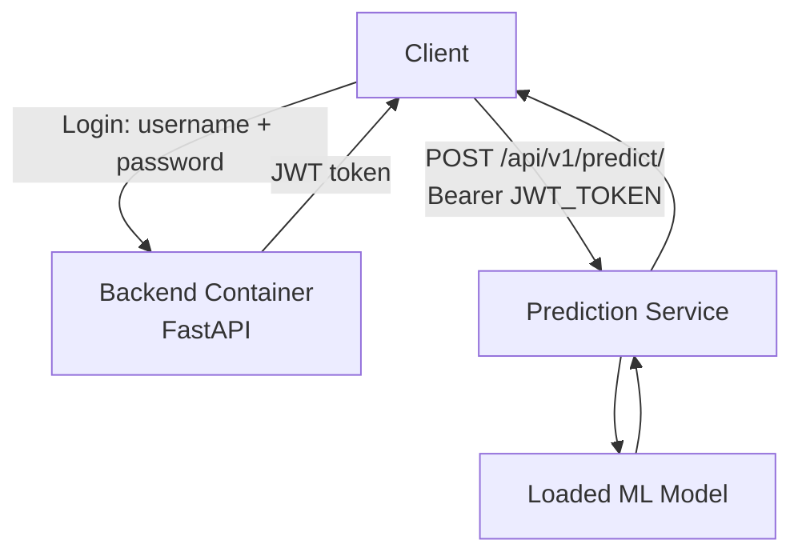
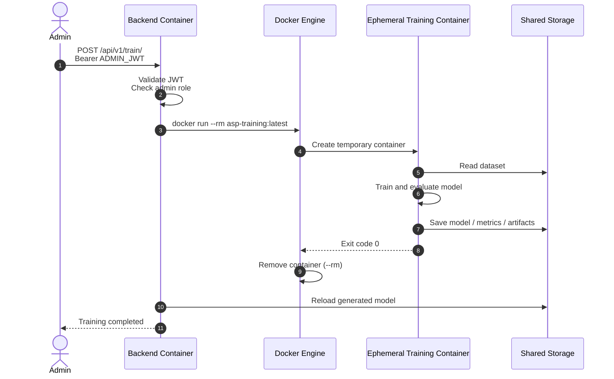

# Backend Service Architecture Overview

The system consists of a persistent **Backend** container and an ephemeral, on-demand **Training** container.

The Backend handles user interactions, authentication, predictions, and training requests. The Training container is not a long-running service. Instead, the Backend triggers a temporary Docker container to perform model training.

Once training is completed, the Training container is automatically removed with `--rm`. The generated artifacts remain in shared storage and are then consumed by the Backend.

## Backend Docker Service

### Environment Configuration

Before starting the Backend, create a `.env.backend` file in the project root.

The file contains the application users and JWT configuration.

```env
# USERS

# Generate a bcrypt password hash and encode it with Base64.
# This avoids issues with "$" characters in bcrypt hashes.

# Example:
# python -c "import bcrypt, base64; h = bcrypt.hashpw(b'password123', bcrypt.gensalt()); print(base64.b64encode(h).decode())"

ADMIN_USERNAME=admin
ADMIN_PASSWORD_HASH_B64=<base64-encoded-admin-password-hash>

USER_USERNAME=datascientest
USER_PASSWORD_HASH_B64=<base64-encoded-user-password-hash>


# JWT

# Generate a strong secret with OpenSSL:
# openssl rand -hex 32

JWT_SECRET_KEY=<openssl-generated-secret>
JWT_ALGORITHM=HS256
JWT_EXPIRE_MINUTES=180
```

> **Security**: Never commit .env.backend to Git. Use a different JWT_SECRET_KEY and password hashes for production environments.


### Authentication

The backend uses JWT __Bearer authentication__.

Two users are configured:

| Username        | Role  | Prediction | Training |
| --------------- | ----- | ---------: | -------: |
| `datascientest` | User  |          ✅ |        ❌ |
| `admin`         | Admin |          ✅ |        ✅ |


### Authentication Flow

After authentication, the API returns a JWT token.

Protected requests must include the generated JWT token: Authorization: Bearer <JWT_TOKEN>




### API Endpoints

#### Health Endpoint

**GET `/api/v1/health`**:

Public health check.

Returns the Backend status and information about the currently loaded model.

__Authentication__: None

#### Prediction Endpoint

**POST `/api/v1/predict/`**:

Generates a prediction using the currently loaded ML model.

__Authentication__: JWT required.

Both `datascientest` and `admin` can access this endpoint.

Client
  │
  │ JWT Bearer Token
  ▼
Backend
  │
  ▼
Loaded ML Model
  │
  ▼
Prediction


#### Training Endpoint

**POST `/api/v1/train/`**

Starts a model training process.

This endpoint is restricted to the admin user.

Authentication: Authorization: Bearer <ADMIN_JWT_TOKEN>

The Backend does not run the training process itself. It uses the Docker Engine to create a temporary Training container.


## Training Architecture



## Training Lifecycle

```text
                 TRAINING REQUEST
                       │
                       ▼
             ┌───────────────────┐
             │ Backend Container │
             └─────────┬─────────┘
                       │
                       │ docker run --rm
                       ▼
          ┌──────────────────────────┐
          │ Ephemeral Training       │
          │ Container                │
          │                          │
          │ 1. Read data             │
          │ 2. Train model           │
          │ 3. Evaluate              │
          │ 4. Save artifacts        │
          └────────────┬─────────────┘
                       │
                       │ exit
                       ▼
                 ┌─────────────┐
                 │ Container   │
                 │ removed     │
                 │ (--rm)      │
                 └──────┬──────┘
                        │
                        │ artifacts persist
                        ▼
              ┌──────────────────────┐
              │ Shared Storage       │
              │                      │
              │ models/              │
              │ metrics/             │
              │ reports/             │
              └──────────┬───────────┘
                         │
                         ▼
              ┌──────────────────────┐
              │ Backend Container    │
              │                      │
              │ Reloads the new      │
              │ model for inference  │
              └──────────────────────┘
```


## Key Distinction

- __Backend -> Docker Engine__: The Backend sends a Docker command to start the training workload.
- __Docker Engine -> Training__: Docker creates and manages the temporary Training container.
- __Training -> Shared Storage__: The Training container reads the dataset and writes the generated artifacts.
- __Container lifecycle__: The Training container exists only for the duration of the training task.
- `--rm`: Docker automatically removes the Training container after it exits.
- __Shared artifacts__: Removing the container does not remove files written to the shared storage.
- __Backend -> Shared Storage__: The Backend loads the newly generated model artifacts for subsequent predictions.


## API Summary

| Endpoint           | Method | Authentication | Purpose                               |
| ------------------ | ------ | -------------- | ------------------------------------- |
| `/api/v1/health`   | `GET`  | None           | Check Backend/model health            |
| `/api/v1/predict/` | `POST` | JWT            | Generate an ML prediction             |
| `/api/v1/train/`   | `POST` | JWT + Admin    | Start an ephemeral training container |


**Roles:**
- `datascientest`: Standard user. Can perform predictions.
- `admin`: Administrator. Can perform predictions and start model training.
