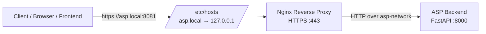

# ASP Reverse Proxy

This document explains how to configure and verify the Nginx reverse proxy used by the Accident Severity Predictor (ASP) development environment.

The reverse proxy provides the client-facing HTTPS entry point and forwards API requests to the internal FastAPI backend.

---

## 1. Architecture

The ASP stack uses Nginx as the TLS-terminating reverse proxy.



From the client's perspective, the API is available at:

```text
https://asp.local:8081
```

Docker maps:

```text
Host port 8081 → Nginx container port 443
```

Nginx then forwards API requests internally to:

```text
http://asp-backend:8000
```

The backend port `8000` is **not published on the host**. It is available only through the Docker network.

This means the intended request path is:

```text
Client
  │
  │ HTTPS :8081
  ▼
Nginx :443
  │
  │ Docker network
  ▼
FastAPI :8000
```

The current Docker Compose configuration defines both containers on the `asp-network` bridge network and publishes only Nginx's HTTPS port to the host.

---

## 2. What Nginx Provides

Nginx currently provides:

* TLS termination;
* HTTP → HTTPS redirection;
* reverse proxying to FastAPI;
* endpoint-specific rate limiting;
* request body size limits;
* request timeout protection;
* security headers;
* gzip compression;
* a fallback `404` response for non-API routes.

The backend remains responsible for application authentication and authorization.

In particular:

* **Nginx TLS** protects the client-to-proxy connection.
* **JWT authentication** protects the backend API endpoints.
* The TLS private key is not used as an API credential and is never sent to the backend.

---

## 3. Prerequisites

Before configuring the reverse proxy, make sure:

* Docker is installed and running;
* Docker Compose is available;
* the project has been cloned;
* the backend configuration is available;
* OpenSSL is installed;
* you can modify `/etc/hosts`.

The backend setup is documented in [Backend](backend.md).

---

## 4. Configure `asp.local`

The development environment uses the hostname:

```text
asp.local
```

Add the following entry to your hosts file:

```text
127.0.0.1 asp.local
```

### Linux / macOS / WSL

```bash
echo "127.0.0.1 asp.local" | sudo tee -a /etc/hosts
```

### Verify the hostname

```bash
getent hosts asp.local
```

Expected result:

```text
127.0.0.1    asp.local
```

If `getent` is not available, you can also use:

```bash
ping -c 1 asp.local
```

The hostname should resolve to `127.0.0.1`.

---

## 5. Generate the Development TLS Certificate

The project provides a script that generates a self-signed certificate for `asp.local`.

From the repository root, run:

```bash
bash infra/nginx/generate-dev-cert.sh
```

The script creates:

```text
infra/nginx/certs/
├── nginx.crt
└── nginx.key
```

The generated certificate includes:

```text
DNS:asp.local
IP:127.0.0.1
```

The private key is generated with restricted permissions and the certificate files are ignored by Git.

### Verify the files

```bash
ls -la infra/nginx/certs/
```

You should see:

```text
nginx.crt
nginx.key
```

> **Important:** These certificates are for local development only. Do not use the generated self-signed certificate in a production deployment.

---

## 6. Start the Backend and Nginx

From the repository root:

```bash
docker compose up -d --build
```

The Compose stack starts the backend and Nginx services.

The Nginx container waits for the backend healthcheck before accepting traffic.

Check the service status:

```bash
docker compose ps
```

You should eventually see both:

```text
asp-backend
asp-nginx
```

with healthy/running states.

---

## 7. Verify the Reverse Proxy

### 7.1 Test HTTPS

Because the development certificate is self-signed, `curl` must skip certificate verification:

```bash
curl -k https://asp.local:8081/api/v1/health
```

A successful request confirms:

```text
Client
  ↓
HTTPS :8081
  ↓
Nginx
  ↓
Backend :8000
  ↓
Health response
```

### 7.2 Test the HTTP → HTTPS redirect

Nginx listens internally on port `80` and redirects HTTP requests to HTTPS.

The host currently publishes only port `8081` for HTTPS, so the redirect is primarily relevant to requests received by Nginx on its internal HTTP listener.

The expected behavior is:

```text
HTTP → 301 → HTTPS
```

---

## 8. Test the Complete API Path

The following tests verify that requests can travel through the reverse proxy to FastAPI.

### Health

```bash
curl -k https://asp.local:8081/api/v1/health
```

### Login

```bash
curl -sk -X POST https://asp.local:8081/api/v1/login \
  -H "Content-Type: application/x-www-form-urlencoded" \
  -d "username=datascientest&password=<USER_PASSWORD>"
```

A successful login should return a JWT access token.

### Prediction

Use the token returned by the login endpoint:

```bash
curl -sk -X POST https://asp.local:8081/api/v1/predict \
  -H "Authorization: Bearer <JWT_TOKEN>" \
  -H "Content-Type: application/json" \
  -d '<prediction-payload>'
```

The reverse proxy forwards the request to:

```text
http://asp-backend:8000/api/v1/predict
```

The backend then performs JWT authentication and prediction.

---

## 9. Rate Limiting

Nginx applies rate limiting before requests reach FastAPI.

The current configuration uses the following limits:

| Endpoint          |               Rate | Burst |
| ----------------- | -----------------: | ----: |
| `/api/v1/login`   |  6 requests/min/IP |     1 |
| `/api/v1/train`   |   1 request/min/IP |     1 |
| `/api/v1/predict` | 10 requests/sec/IP |    20 |
| `/api/v1/health`  | 20 requests/sec/IP |    50 |

If a request exceeds the configured limit, Nginx returns:

```text
HTTP 429 Too Many Requests
```

The limits are keyed by client IP address.

---

## 10. Verify Rate Limiting

### Login rate limit

Run several login attempts quickly:

```bash
for i in 1 2 3 4 5 6 7 8; do
  curl -sk -o /dev/null \
    -w "attempt $i -> %{http_code}\n" \
    -X POST https://asp.local:8081/api/v1/login \
    -H "Content-Type: application/x-www-form-urlencoded" \
    -d "username=ratecheck&password=wrong"
done
```

After the configured limit is exceeded, you should receive:

```text
429
```

Do not use valid credentials for this test.

---

## 11. Security Headers

Nginx adds security-related response headers, including:

```text
Strict-Transport-Security
X-Frame-Options
X-Content-Type-Options
X-XSS-Protection
Referrer-Policy
Permissions-Policy
```

Verify them with:

```bash
curl -k -I https://asp.local:8081/api/v1/health
```

Check that the expected headers are present in the response.

---

## 12. TLS Verification

You can inspect the certificate presented by Nginx with:

```bash
openssl s_client \
  -connect asp.local:8081 \
  -servername asp.local
```

Because the certificate is self-signed, certificate verification errors are expected unless the certificate is explicitly trusted by the local system.

For normal development API calls, use:

```bash
curl -k ...
```

---

## 13. Verify that the Backend Is Not Directly Exposed

The backend uses Docker's `expose` directive rather than publishing port `8000` to the host.

Therefore:

```text
Host
 ├── :8081 → Nginx
 │              │
 │              └── asp-backend:8000
 │
 └── :8000 → not published
```

The intended client entry point is therefore:

```text
https://asp.local:8081
```

rather than:

```text
http://localhost:8000
```

This keeps the backend behind the reverse proxy and ensures that client requests pass through the configured TLS and rate-limiting layer.

---

## 14. Troubleshooting

### `asp.local` does not resolve

Check `/etc/hosts`:

```bash
grep asp.local /etc/hosts
```

Expected:

```text
127.0.0.1 asp.local
```

---

### Certificate files are missing

Run:

```bash
bash infra/nginx/generate-dev-cert.sh
```

Then verify:

```bash
ls -la infra/nginx/certs/
```

---

### Nginx is not running

Check:

```bash
docker compose ps
```

Then:

```bash
docker compose logs nginx
```

---

### Backend is unhealthy

Check:

```bash
docker compose ps
docker compose logs backend
```

The backend healthcheck uses:

```text
http://localhost:8000/api/v1/health
```

inside the backend container.

---

### Nginx cannot reach the backend

Check that both containers are running:

```bash
docker compose ps
```

Check the Docker network:

```bash
docker network inspect asp-network
```

Both `asp-nginx` and `asp-backend` should be attached to the network.

---

### `curl` reports a certificate error

The development certificate is self-signed.

Use:

```bash
curl -k https://asp.local:8081/api/v1/health
```

The `-k` option disables certificate verification for this local development test.

Do not use this approach for production certificate validation.

---

### Port 8081 is already in use

Check which process is using the port.

Linux/WSL:

```bash
ss -ltnp | grep 8081
```

Windows PowerShell:

```powershell
Get-NetTCPConnection -LocalPort 8081
```

Stop the conflicting service before starting the ASP stack.

---

## 15. Security Notes

The current reverse proxy provides the following development security controls:

* HTTPS using TLS 1.2 and TLS 1.3;
* a locally generated self-signed certificate;
* HTTP → HTTPS redirection;
* request body size limits;
* request timeouts;
* endpoint-specific rate limiting;
* security response headers;
* backend isolation through the Docker network.

The TLS private key:

```text
infra/nginx/certs/nginx.key
```

is used only by Nginx for TLS termination.

It is **not** a JWT secret and must never be sent to the backend as an HTTP header or used as an application credential.

The backend's `JWT_SECRET_KEY` has a separate purpose: signing and validating JWT access tokens.

---

## 16. Quick Verification Checklist

Use this checklist when setting up the reverse proxy on a new machine:

```text
[ ] Docker is running
[ ] Repository is cloned
[ ] Backend configuration is available
[ ] asp.local is present in /etc/hosts
[ ] nginx.crt exists
[ ] nginx.key exists
[ ] docker compose up -d --build completed
[ ] asp-backend is healthy
[ ] asp-nginx is running
[ ] https://asp.local:8081/api/v1/health works
[ ] Login returns a JWT
[ ] Protected prediction request works
[ ] Rate limiting returns HTTP 429 when exceeded
[ ] Security headers are present
```

For backend authentication and API details, see [Backend](backend.md).
